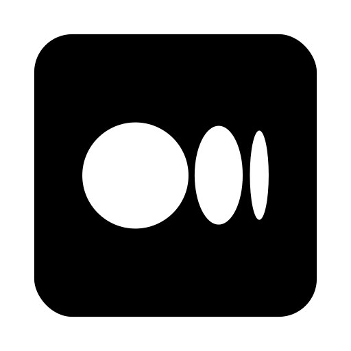

### 🚀 Full Stack Developer | Mobile & Backend Apps

### 👨‍💻 What I Do

* Build mobile apps with **Flutter** that look sharp and run smoothly
* Develop backends using **.NET**, **Java**, and cloud tools like **Firebase**, **GCP**, and **AWS**
* Design and consume **REST APIs**
* Contribute to **Open Source Projects** and share knowledge through **blogging**

---

### 🧠 Tech I Love Working With

* 💙 Flutter
* 🧱 .NET & Java
* 🔥 Firebase & Firestore
* ☁️ Google Cloud Platform & AWS
* 🔗 REST API Design
* 🤩 OSS (Open Source)
* ✍️ Medium (Blogger)

---

### ✨ Always Building & Learning

* AI-powered apps with **Gemini AI**
* Custom Flutter themes & animations
* CI/CD pipelines for **Android & iOS** (Fastlane, GitHub Actions)
* Full-stack projects with a clean code mindset

---

### 🔗 Let’s Connect

     

### 🔗 Let’s Connect

---

### 📈 GitHub Stats

[]

---

✨ *Let’s build something cool, animated, and meaningful — one widget at a time.*

